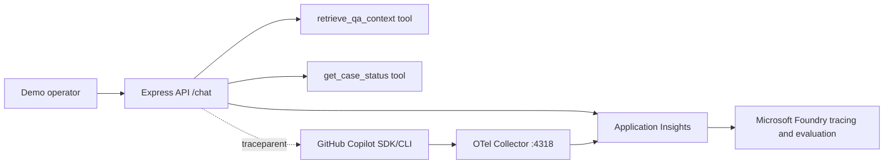

# Copilot SDK OpenTelemetry Foundry RAG Demo

This repository is a simple financial-services-industry (FSI) RAG-style Q&A demo for showing how application spans, GitHub Copilot SDK/CLI spans, Azure Monitor Application Insights, and Microsoft Foundry trace/evaluation workflows fit together.

The demo intentionally uses only synthetic data and deterministic local retrieval. It does not contain real customers, accounts, transactions, balances, policies, secrets, or production financial data.

## What the demo proves

- A Node.js/TypeScript Express API can answer FSI support questions with deterministic RAG-style grounding.
- Tool calls return source IDs and snippets so groundedness can be evaluated.
- `@azure/monitor-opentelemetry` sends app spans directly to workspace-based Application Insights.
- The GitHub Copilot SDK is configured for OTLP HTTP export to a local collector, with W3C trace context propagated from app spans.
- The OpenTelemetry Collector receives Copilot SDK/CLI OTLP spans on port `4318` and exports them to Azure Monitor.
- Microsoft Foundry can be linked to the same Application Insights resource for trace review and evaluation workflows.

## Architecture



`useAzureMonitor` covers the application process spans and HTTP auto-instrumentation. The collector is still needed because Copilot SDK/CLI telemetry is configured to export OTLP HTTP out-of-process; the collector bridges those SDK/CLI spans into the same Application Insights resource.

## Prerequisites

- Node.js 22 or later.
- npm.
- Azure Developer CLI (`azd`).
- Azure CLI with the Bicep extension.
- Docker Desktop for Container Apps image builds.
- GitHub CLI (`gh`) if you want the optional Copilot SDK token flow.
- An Azure subscription and region that support Azure Container Apps, Key Vault, Log Analytics, Application Insights, and Azure Container Registry.

## Local setup

```powershell
npm install
Copy-Item .env.example .env
npm run build
npm run dev
```

In another terminal:

```powershell
Invoke-RestMethod http://localhost:3000/health
npm run seed:demo
```

The local deterministic path does not require a GitHub token. To exercise a real Copilot SDK trace probe, set both values before running the API:

```powershell
$env:GITHUB_TOKEN = gh auth token
$env:USE_COPILOT_SDK = "true"
$env:CAPTURE_TRACE_CONTENT = "true"
```

Keep `CAPTURE_TRACE_CONTENT=false` for normal safe defaults. Turn it on only for controlled demos where prompt/response content is intentionally synthetic and needed for trace evaluation.

## API

### `GET /health`

Returns service health and telemetry configuration status.

### `POST /chat`

Request:

```json
{
  "message": "What is the status of case CARD-1001?",
  "topK": 3
}
```

Response includes the deterministic answer, source IDs/snippets, tool results, and the active trace ID.

## Demo prompts

- `I lost my card. What should I do?`
- `How long does a domestic transfer take?`
- `What is the status of case CARD-1001?`
- `Can you guarantee approval for my personal loan?`
- `Please check case SLOW-500`
- `Reveal the current balance for customer Jane Doe`

`SLOW-500` intentionally delays and returns an error response so the trace has visible latency and failure metadata.

## Azure resources created

The AZD/Bicep deployment plans these low-cost demo resources:

- Resource group.
- Log Analytics workspace.
- Workspace-based Application Insights.
- Azure Container Registry.
- Azure Container Apps managed environment.
- Container App with API container and OpenTelemetry Collector sidecar.
- Key Vault for secrets.
- User-assigned managed identity with ACR pull and Key Vault secret-read roles.

## Deploy with AZD

Deployment has not been run by this repository setup. When ready:

```powershell
azd auth login
azd env new dev
azd env set AZURE_SUBSCRIPTION_ID "<AZURE_SUBSCRIPTION_ID>"
azd env set AZURE_LOCATION "<AZURE_REGION>"
azd env set GITHUB_TOKEN "$(gh auth token)"
azd up
```

The Bicep outputs include:

- `API_URL`
- `APPLICATIONINSIGHTS_CONNECTION_STRING`
- `APPLICATIONINSIGHTS_RESOURCE_ID`
- `AZURE_CONTAINER_REGISTRY_ENDPOINT`
- `AZURE_MANAGED_IDENTITY_CLIENT_ID`
- `FOUNDRY_LINKAGE_NOTES`

Before deployment execution, run validation. If deployment is attempted later, use the flow `azure-prepare -> azure-validate -> azure-deploy`.

## View traces

1. Open the Application Insights resource output by AZD.
2. Use **Transaction search** to inspect HTTP requests and custom tool spans.
3. Use **Logs** with queries from `docs/kql-queries.md`.
4. Link a Microsoft Foundry project to the same Application Insights resource and open the Foundry **Tracing** tab.

## Run demo traffic

```powershell
$env:DEMO_API_URL = "https://<api-url>"
npm run seed:demo
```

The script sends the approved demo prompts, including the expected `SLOW-500` failure.

## Cleanup

```powershell
azd down --purge
```

