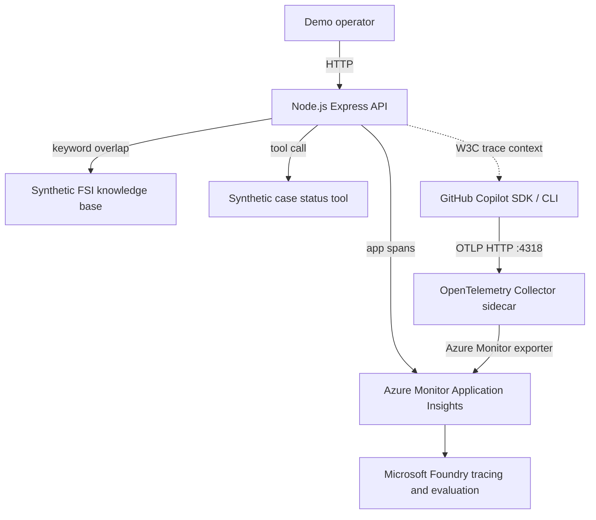

# Architecture

## Flow

1. `POST /chat` validates the request and creates a parent chat span.
2. `retrieve_qa_context` scores synthetic knowledge-base entries by keyword overlap.
3. `get_case_status` returns deterministic synthetic case state. `SLOW-500` delays and throws to create a visible failure trace.
4. The API returns a grounded answer with source IDs and snippets.
5. Application spans flow directly to Application Insights through `@azure/monitor-opentelemetry`.
6. Optional Copilot SDK probes receive active W3C trace context through `onGetTraceContext` and export OTLP HTTP spans to the collector.
7. Microsoft Foundry can use the same Application Insights resource for trace inspection and evaluation.

## Why no Azure AI Search in v1

The goal is to explain telemetry, trace correlation, tool calls, and evaluation without adding retrieval infrastructure cost or nondeterminism. Local retrieval makes the demo repeatable and easy to reason about.

